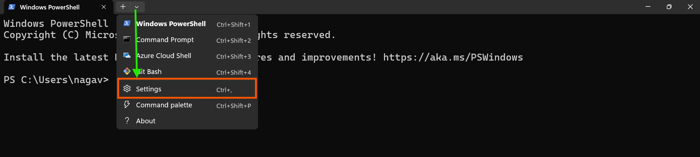
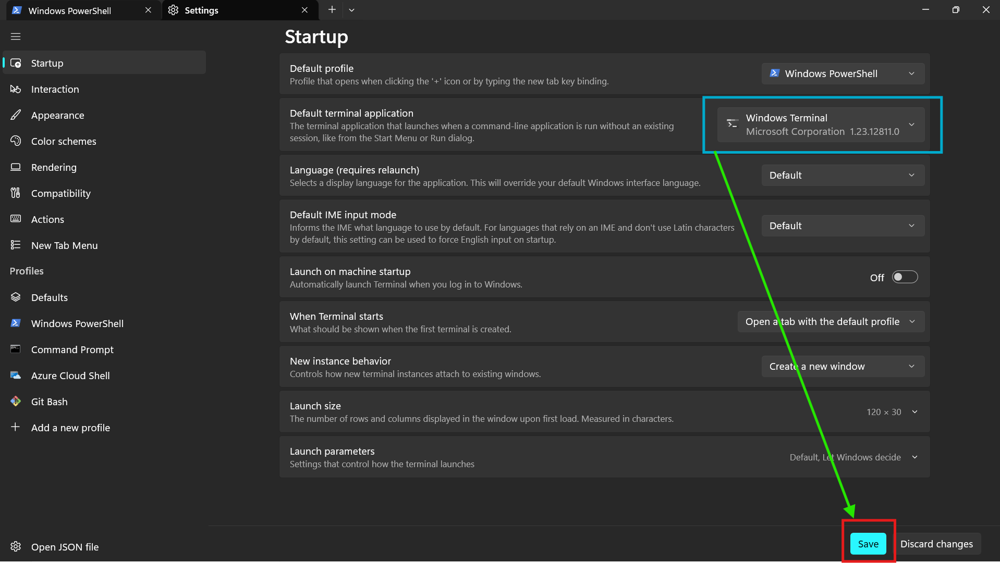
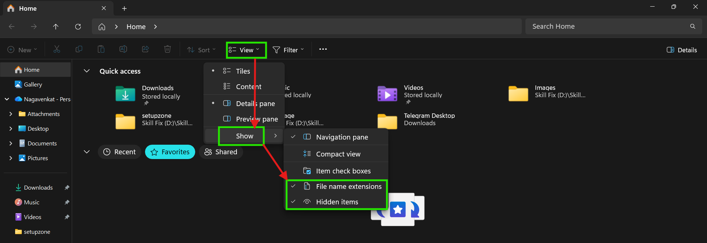

# System Setup and Configuration 

## Terminal 

# How to install Terminal

## **Windows Terminal comes pre-installed by default on Windows 11, while Windows 10 users need to install it manually from the Microsoft Store.**

### What is a **Terminal** and **Windows Terminal**?

- A terminal is a program that lets you interact with your computer by typing text commands.
- Instead of clicking icons, you type commands to open files, run programs, and manage the system.
- It’s a powerful tool for developers and system administrators.

## What is Windows Terminal?

- Windows Terminal is a modern terminal program for Windows.
- It lets you use multiple command-line tools like:
  - **PowerShell**
  - **Command Prompt (CMD)**
  - **Git Bash**
  - **Linux shells (via Windows Subsystem for Linux)**

- It supports **multiple tabs** and **split panes**, so you can use many terminals in one window.
- You can customize colors, fonts, key shortcuts, and more.
- Makes working with command line tools easier and more organized.

### Why Use Windows Terminal?
- Combines many command shells in one interface.
- More flexible and powerful than the old default consoles.
- Suited for developers, DevOps, and power users.

---

# Additional setting for better usage terminal
- Click on settings as shown in below figure

- Here, `Set Windows Terminal as the default application` and Click `Save`

---

# How to Show File Extensions and Hidden Files in Windows Explorer

### Show File Name Extensions

- Go to the top menu and click **View**.
- From the dropdown, select **Show**, then tick **File name extensions**.
- This will display extensions like ".txt", ".jpg", ".exe" for each file in File Explorer.
- Knowing extensions helps you identify file types and avoid confusion (for example, knowing if a file is actually a program, image, or document).

### Show Hidden Files (Hidden Items)

- In the same **View > Show** dropdown, tick **Hidden items**.
- This will make hidden files and folders (usually faded out) visible in File Explorer.
- Hidden files are commonly used for system or application settings and can be useful for troubleshooting or editing configurations.
