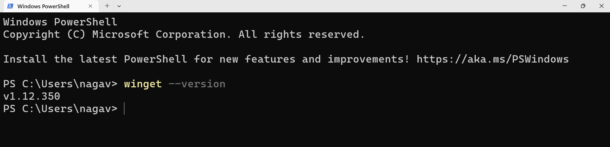

# What is Winget?

- WINGET stands for **Windows Package Manager**. 
- It is a command-line tool from Microsoft that helps users discover, install, upgrade, remove, and manage applications on Windows systems efficiently through simple commands.
- Winget comes pre-installed on Windows 11 and newer Windows 10 versions; otherwise, install it from Microsoft Store.

### How to start

1. Open **terminal**/**PowerShell**.  
2. Type `winget --version` to check if Winget is installed.  

### Run commands like install, and upgrade and uninstall as needed.

- **Install app:**  
  `winget install <app_id>`  
  (Example: `winget install Microsoft.VisualStudioCode`)

- **Upgrade apps:**  
  `winget upgrade`  
  (Upgrades all apps that can be updated)

- **Uninstall app:**  
  `winget uninstall <app_id>`  
  (Example: `winget uninstall --purge Google.Chrome`)

  Here, `--purge` Deletes all files and directories in the package directory (portable)

***

 