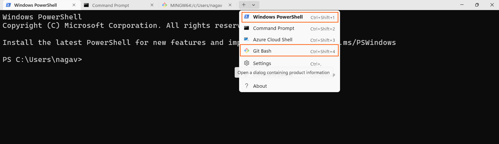
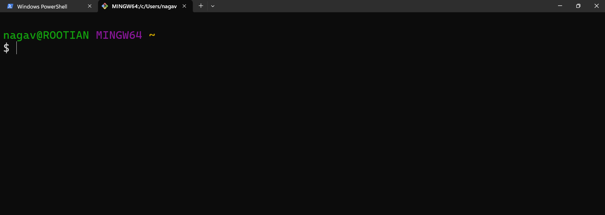

# Git Bash

## How to install Git Bash?
**[Refer Here](https://git-scm.com/install) to install **Git Bash**.**

- First download `Git Bash.exe`
- While installing Click on check box `Add Git Bash profile to Windows Terminal`

##  What is Git Bash?
- Git Bash is a command-line tool for Windows that provides a Unix-style shell environment. 
- It allows users to run Git commands and use common Unix commands on Windows. 
- It is included as part of the Git for Windows package, helping developers manage version control easily.

**💡 Note:**
After installing Git, open Windows Terminal and check if **Git Bash** is available in the dropdown.  
You should see both **PowerShell** and **Git Bash** options.

👉 We will mainly use:
- **PowerShell (for most commands)**
- **Git Bash (for Git-related operations)**
***