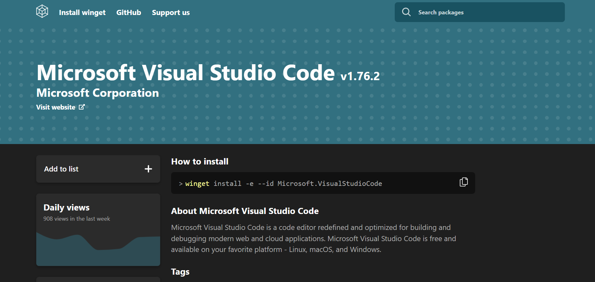
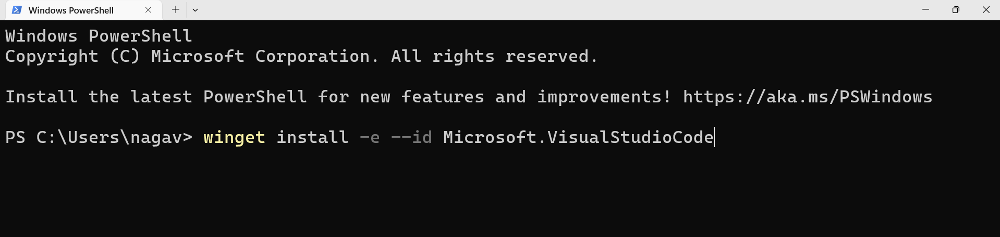

# VS code
## How to install VS code?
There are mainly **three** ways to install Visual Studio Code (VS Code):

1. Download and run the installer from the official VS Code website.  
2. Install using the Microsoft Store app on Windows.  
3. Use command-line package managers like `Winget` or `Chocolatey` for automated installation.  

[Refer Here](https://winget.run/pkg/Microsoft/VisualStudioCode) to install vscode.

- Let's install with winget

- Open your Terminal run the command to install VS Code 

##  What is VS code?

- Visual Studio Code (VS Code) is a free, lightweight code editor that supports multiple programming languages.
- It helps you write, edit, and run code efficiently with features like IntelliSense, debugging, and extensions.
- You start by opening a folder, creating files, and using its powerful tools for coding, testing, and debugging.
***

