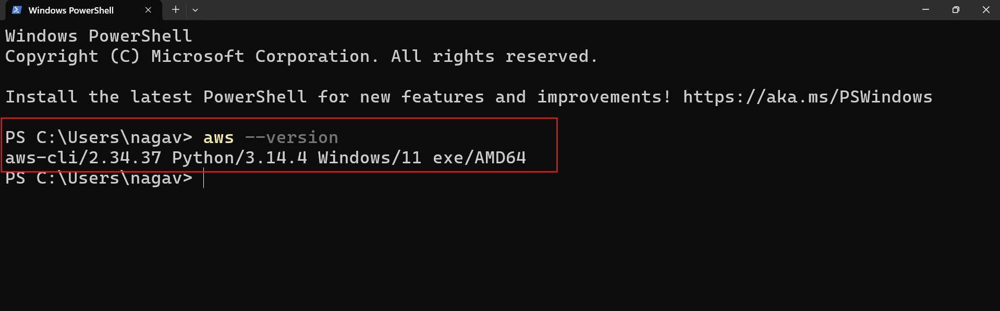
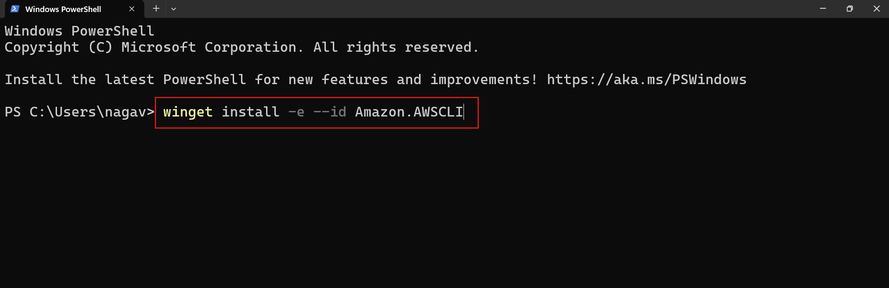

# What is AWS CLI?
  AWS CLI (AWS Command Line Interface) is a tool that lets you manage AWS services from your terminal using commands. It allows you to automate tasks and control AWS resources without using the web console. With simple commands, you can launch instances, manage storage, and configure services efficiently.


# How to Install AWS CLI

## AWS CLI (Command Line Interface)

The AWS CLI is a unified tool to manage AWS services from the command line.

---

## 🪟 Install AWS CLI on Windows

### Option 1: Official Installer (Recommended)

Download the official MSI installer from AWS and follow the setup wizard:

* 📘 [AWS CLI Installation Documentation](https://docs.aws.amazon.com/cli/latest/userguide/getting-started-install.html)

---

### Option 2: Install Using winget

You can install or update AWS CLI using the Windows package manager:

```bash
winget install -e --id Amazon.AWSCLI
```


#### Alternative GUI Sources:

* 🔗 [winget.run – AWS CLI](https://winget.run/pkg/Amazon/AWSCLI)
* 🔗 [winstall.app – AWS CLI](https://winstall.app/apps/Amazon.AWSCLI)

---

## 🍎 Install AWS CLI on macOS

### Option 1: Using Homebrew

```bash
brew install awscli
```

### Option 2: Official PKG Installer

Download and install from AWS official documentation:

* 📘 https://docs.aws.amazon.com/cli/latest/userguide/getting-started-install.html

---

## ✅ Verify Installation

After installation, confirm AWS CLI is installed correctly:

```bash
aws --version
```


Expected output (example):

```bash
aws-cli/2.x.x Python/3.x.x Windows/Linux/macOS
```

---

## 🖼️ Installation Reference



---

## 💡 Notes

* Always install **AWS CLI v2** (latest version)
* Ensure your system PATH is updated automatically after installation
* Restart terminal if command is not recognized

---


