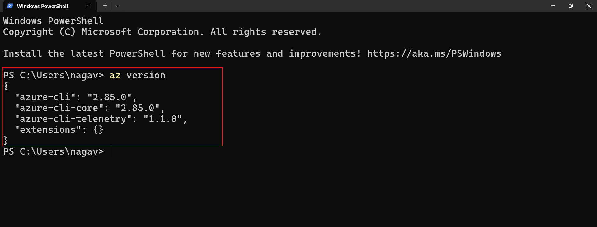

# How to install AZURE CLI?


## AZURE CLI(Command Line Interface)

- On **Windows**, you can install Azure CLI by downloading and running the MSI installer from the official Microsoft link or use PowerShell with a command to download and install automatically.  

    [Azure Documentation](https://learn.microsoft.com/en-us/cli/azure/install-azure-cli-windows?view=azure-cli-latest&pivots=winget) to install azure cli.

- You can also install Azure CLI easily using winget by running:  
    [winget.run](https://winget.run/pkg/Microsoft/AzureCLI) to install azure cli.

  ```
  winget install -e --id Microsoft.AzureCLI
  ```


- On **macOS**, install Azure CLI using Homebrew with:  
  ```
  brew install azure-cli
  ```

- After installation, verify by running `az --version` in your terminal or PowerShell.




##  What is AZURE CLI?
- Azure CLI is a cross-platform command-line tool that lets you manage Azure resources from the terminal. It allows you to create, update, and delete resources using simple commands or scripts, making cloud management faster and easier. Azure CLI works on Windows, macOS, and Linux, and can also be used in Azure Cloud Shell directly from a browser.
***
