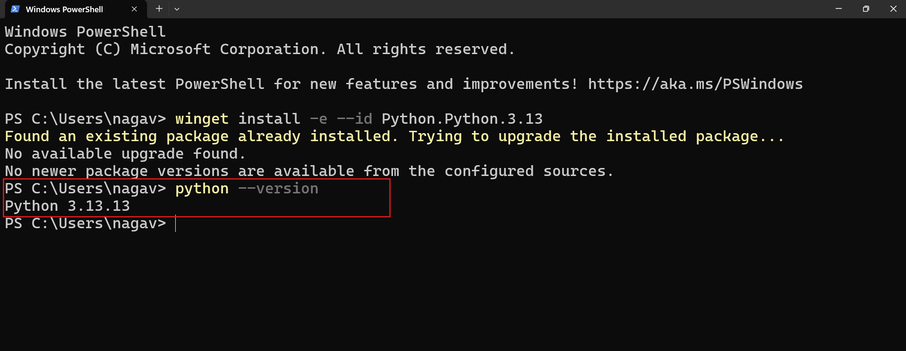

# Installing Python and UV for Python Learning

##  How to install python?

To install Python on Windows using winget, open Terminal and follow these simple steps. 

## Step 1: Install
Use the ID for your preferred version, e.g.:  
`winget install -e --id Python.Python.3.13` 

## Step 2: Verify
Close and reopen your terminal, then run:  
`python --version`  
You should see the installed version (e.g., Python 3.13.x). 

### Tip
- **Reopen terminal after install for PATH changes to apply.** 

# Installing UV on Windows

## What is UV?

UV is an ultrafast Python package and project manager built in Rust by Astral.  
It replaces tools like pip, venv, and pip-tools with a single, unified CLI for managing packages, virtual environments, and Python versions. 

## Why Use UV?

UV delivers 10-100x faster package installs through parallel downloads and smart caching.  
It streamlines workflows with automatic virtualenvs, lockfiles, and dependency resolution for more reliable projects. 

## UV vs Pip

| Aspect | UV | Pip |
|--------|----|-----|
| Speed | 10-100x faster | Baseline |
| Features | Built-in venv, locking, Python mgmt | Installs only |
| Language | Rust binary | Python script |
| Use Case | Full project tool | Simple installs | [pydevtools](https://pydevtools.com/handbook/explanation/whats-the-difference-between-pip-and-uv/)

## Install UV Using Winget

Open Terminal.  
Run: `winget install -e --id astral-sh.uv`  
Verify: `uv --version` (adds to PATH automatically). [winstall](https://winstall.app/apps/astral-sh.uv)

### Tip
- Reopen terminal after install for PATH changes to apply. 
