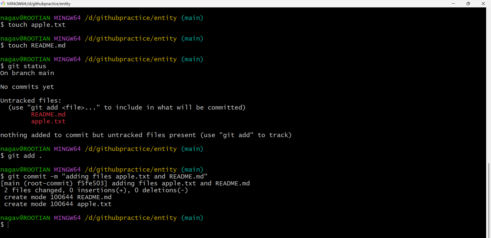

# How to create GitHub account

- [Refer Here](https://github.com/) to signup GitHub.


- To create GitHub account, signup with `email` and create `username` 


- After creating github account login page will be like 


***

# How to create a repository in GitHub (Remote Repository)

- Let's creat repository in Git and clone to local system/machine. 

- click on `Create repository` 


- When creating a remote repository on platforms like **GitHub, GitLab, or Bitbucket**, the repository page displays **two clone URLs**: HTTPS and SSH.

## HTTPS URL Format
```
https://github.com/username/repository.git
```
- Uses username/password or personal access token (PAT) for authentication.
- Prompts for credentials on each push/pull (unless cached).
- Works everywhere without SSH setup.

## SSH URL Format
```
git@github.com:username/repository.git
```
- Requires SSH key setup (public key added to your account).
- Passwordless authentication via your private key.
- Faster/more secure for frequent operations.


## When to Use SSH vs HTTPS?

### Use **SSH** when:
- ✅ You're a **regular Git user** (daily pushes/pulls)
- ✅ **Corporate/personal machine** - one-time key setup  
- ✅ Need **maximum security** (keys > passwords)
- ✅ **Automation/CI/CD** pipelines
- ✅ No firewall blocking port 22

### Use **HTTPS** when:
- ✅ **Beginners** - simpler setup (no keys)
- ✅ **Corporate firewalls** block SSH (port 22)
- ✅ Working on **shared/public computers**
- ✅ **Quick testing** from new machines/instances/virtual mahcines
- ✅ Behind **proxies** that only allow port 443

### Quick Decision Table

| Scenario | SSH | HTTPS |
|----------|-----|-------|
| Daily development | ✅ **Recommended** | ❌ |
| Corporate firewall | ❌ | ✅ **Recommended** |
| Beginner friendly | ❌ | ✅ **Recommended** |
| Max security | ✅ **Best** | Good |
| One-time setup | More work | Easier |

---


# How to Clone a Remote Git Repository to Local Using SSH URL?

### usecase 1: cloning remote repo to local using **SSH URL**

- open Terminal, Create one folder and `cd into the folder`

```bash
mkdir githubpractice
cd githubpractice
git clone <SSH URL>
```

- after cloning cd into the `repo` (as shown in the below image)

```bash
cd entity
```
- If you're using Terminal/PowerShell, it looks like this:


- If you're using Git Bash, it looks like this:


- Now, in the repo try to 
    - `create some files` and 
    - `add` those files to files to staging area
    - `commit` all the changes




#### Now, To push all the local changes to the git remote repo, we need to do some additional configurations

## Prerequisites for Pushing to Remote Repository

1. Git User Identity (username & email for commits)
2. SSH Key Authentication (secure passwordless access)  
3. Remote Origin Setup (link local repo to GitHub)

