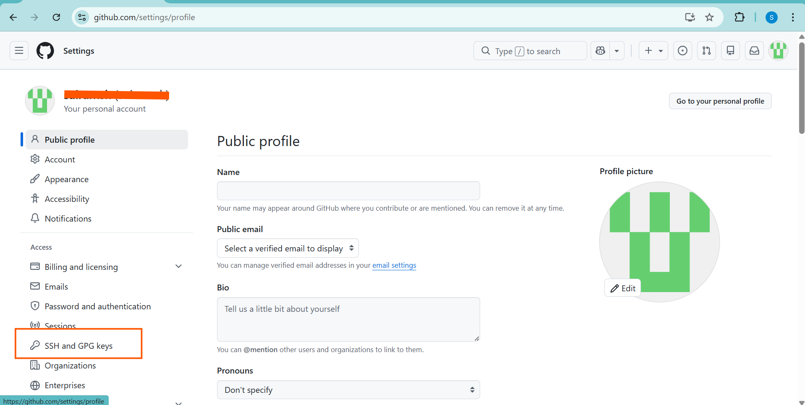
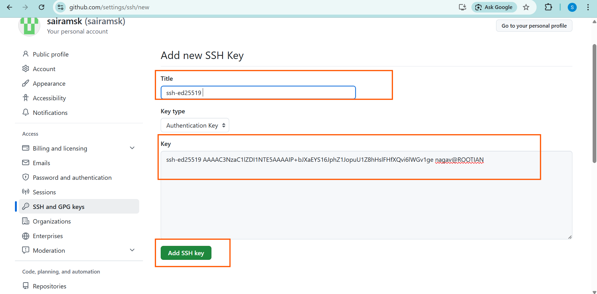

## 1. How to Add an `SSH Key to GitHub`? 

- Open settings and click on `SSH and GPG Keys`



- Then, Click on `NEW SSH Key`


- Add `public key` in the `key section` and give a `title`. 
    - click on `ADD SSH KEY`




- you will see Succesfully congigured ssh keys to GitHub.


### NOTE

- [Refer Here](https://github.com/pnvenkatakrishna/sshkeys_setup/blob/main/sshkeyssetup.md) to understand **ssh keys generation**

- To add `public key`, open your `GitBash` and check as shown in the below image. 


## Test SSH Connection to GitHub

**Verify your SSH key works with GitHub:**

```bash
ssh -T git@github.com
```

**Expected output:**
```
Hi username! You've successfully authenticated, but GitHub does not provide shell access.
```

**What it does:**
- Tests SSH connection without interactive shell
- Confirms your public key is correctly added to GitHub
- Shows your authenticated username

## 3. Set Up Remote Origin (First Time Only)

**"origin"** = Default name for your main remote repository.

**Steps:**

1. **Copy SSH URL** from GitHub repo → *Code* → *SSH*
   ```
   git@github.com:username/repo.git
   ```

2. **Add remote origin:**
   ```bash
   git remote add origin git@github.com:username/repo.git
   ```

3. **Verify remote:**
   ```bash
   git remote -v
   ```
   **Output:** `origin git@github.com:username/repo.git (fetch/push)`

4. **Push with upstream tracking:**
   ```bash
   git push -u origin main
   ```

**After first push:** Just use `git push` for future commits.


