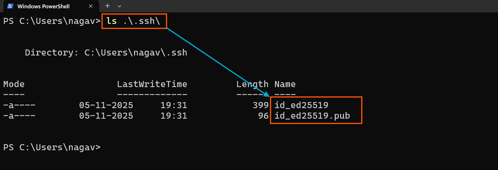
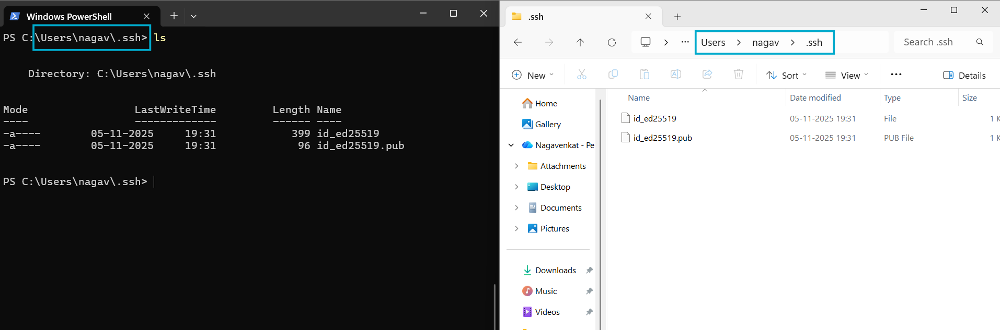

# How to Generate SSH Keys on a Windows Machine

## To Generate SSH Key Pair in Windows

- Open the Terminal or PowerShell.

- Run the command:

  ```bash
  ssh-keygen
  ```
  - Press Enter to choose the default file location (e.g., `C:\Users\YourUserName\.ssh\id_ed25519`).


  - Optional: Add a passphrase or leave blank for no passphrase.
- Your public key will be found at `C:\Users\YourUserName\.ssh\id_ed25519.pub`.




### Why SSH keys are in the `.ssh` folder

- `.ssh` is the default folder where SSH looks for keys.
- It keeps `keys` organized and safe.



- Only you can access it, protecting your private key.
- To read the public and private keys
   - open `GitBash` 
   ```bash
   cd .ssh/  # Change directory to the hidden SSH configuration folder in the user's home directory.
   cat id_ed25519     # To read/view Private Key
   cat id_ed25519.pub # To read/view Publick Key
   ``` 


