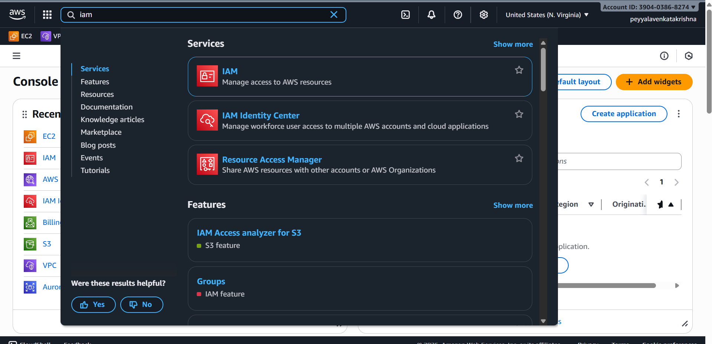
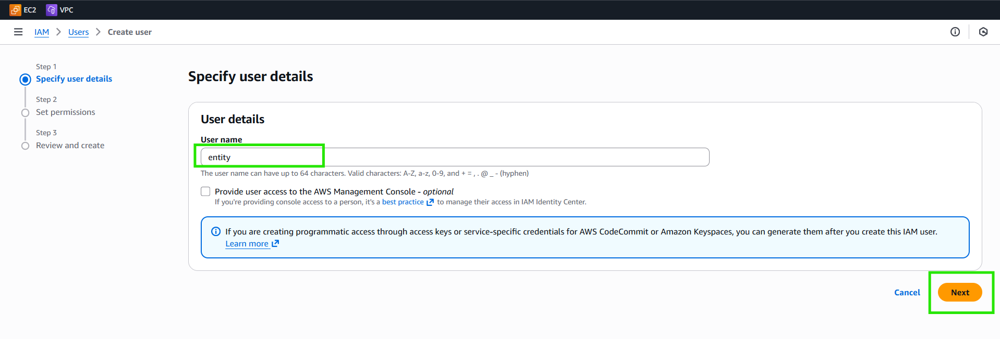
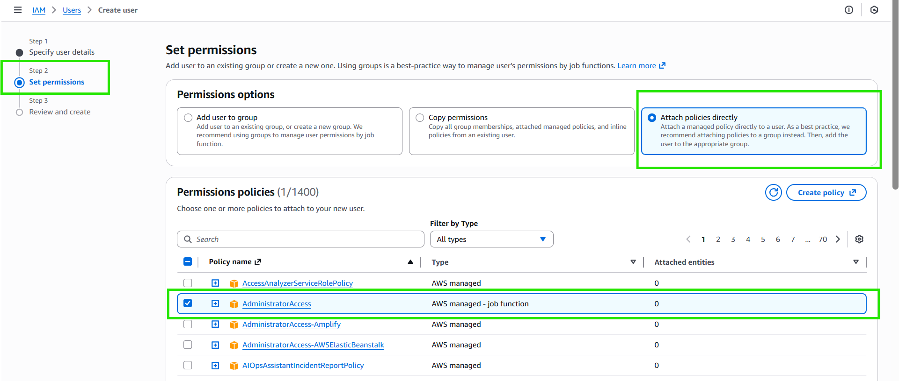
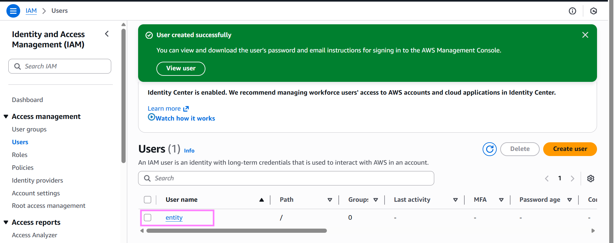
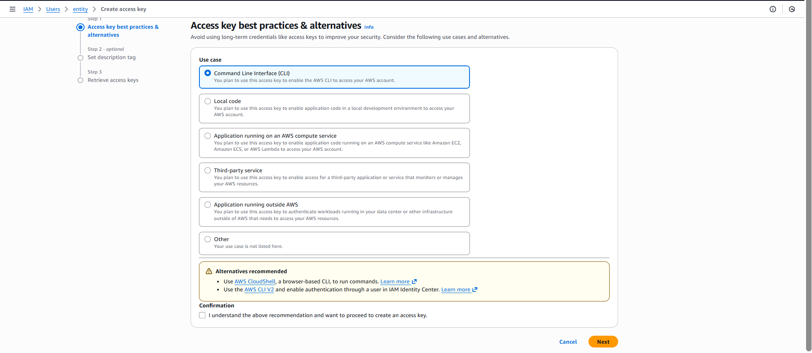
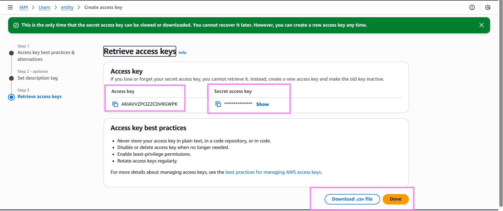

# How to Configure AWS CLI to Your AWS Account

1. **Create an IAM User:**  
   - Go to the AWS Management Console and open the IAM service.



- Create a new IAM user with **programmatic access** enabled. 


- **Let's create a user**
    


- **Assign the required permissions to the user (e.g., AdministratorAccess or custom policies).**  




- after creation user it will show like this



- Download or note down the **Access Key ID** and **Secret Access Key** for this user.


- next click on cli 



- These are the access keys




2. **Configure AWS CLI:**  
   - Open your terminal
   - Run the command:  
     ```bash
     aws configure
     ```
   - Enter the IAM user’s Access Key ID, Secret Access Key, default region (like `us-east-1`), and preferred output format (`json`, `text`, or `table`).  
   - This setup lets AWS CLI communicate securely with your AWS account using the IAM user credentials.


## How to Verify AWS CLI Setup and Configuration

- To verify if AWS CLI is configured and connected to your account, run:  
  ```
  aws s3 ls
  ```
  If this lists your buckets, your AWS CLI is properly connected and has permissions.

- You can also view CLI configuration details with:  
  ```
  aws configure list
  ```

- Another quick check is to list your S3 buckets with:
  ```
  aws sts get-caller-identity
  ```


***
