# AWS Free Tier Account Creation Guide

## Objective

This guide explains how to create a new AWS account for accessing AWS services.

---

# Prerequisites

Before you begin, ensure you have the following:

- Valid Email Address
- Mobile Number for OTP Verification
- Debit/Credit Card with International Transactions Enabled
- Stable Internet Connection

---

# Step 1: Open the AWS Free Tier Website

Open the following website:

https://aws.amazon.com/free/

Click **Create a Free Account**.

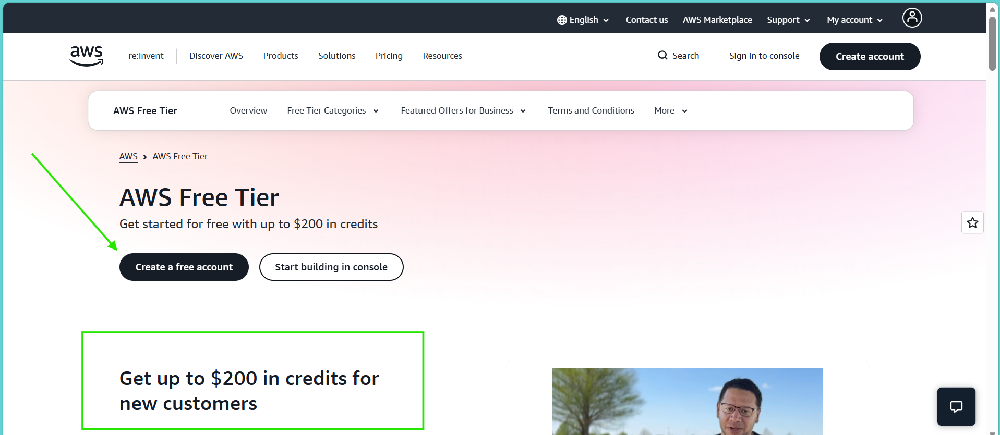

---

# Step 2: Enter Account Information

Provide the following details:

- Email Address
- AWS Account Name

Click **Verify Email Address**.

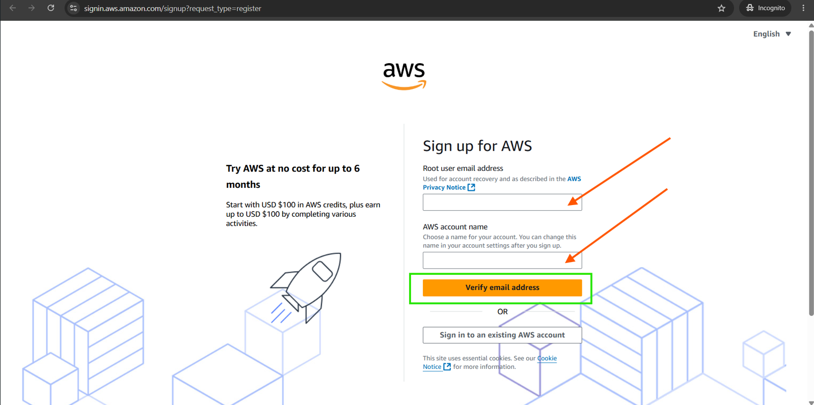

---

# Step 3: Verify Your Email Address

- Check your email inbox.
- Enter the verification code received from AWS.
- Click **Verify**.✅

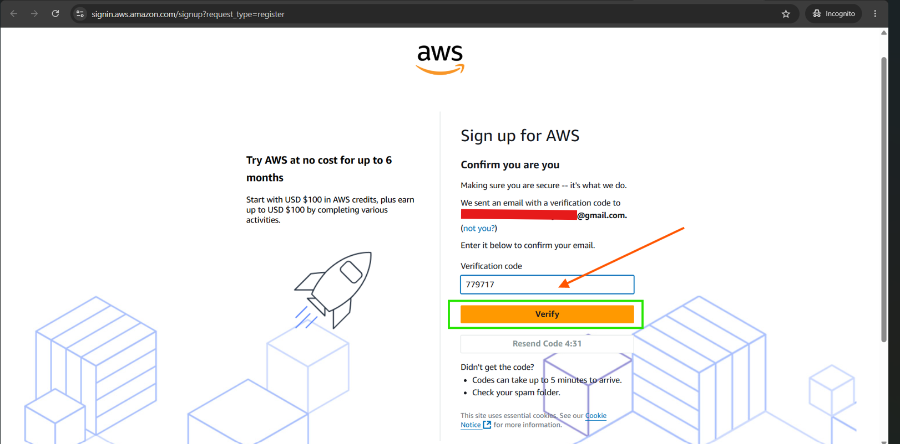

---

# Step 4: Create a Root User Password

Create a strong password for your AWS Root User account.

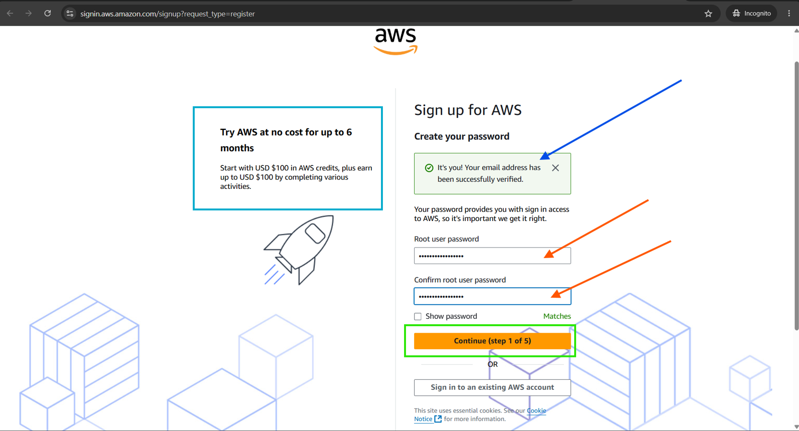

Click **Continue**.✅
---
# To create Free Tier account
Click on **Choose Free Plan**

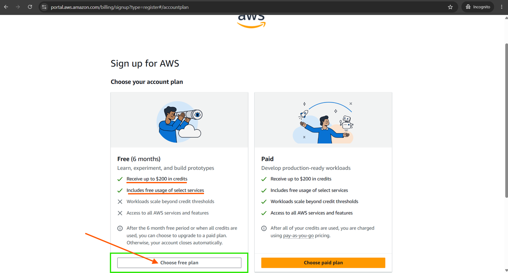
---

# Step 5: Enter Contact Information

Enter the following information:

- Full Name
- Phone Number
- Country/Region
- Address
- City
- State/Province
- Postal Code

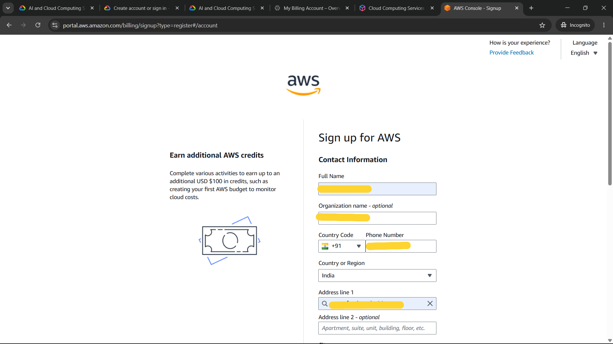

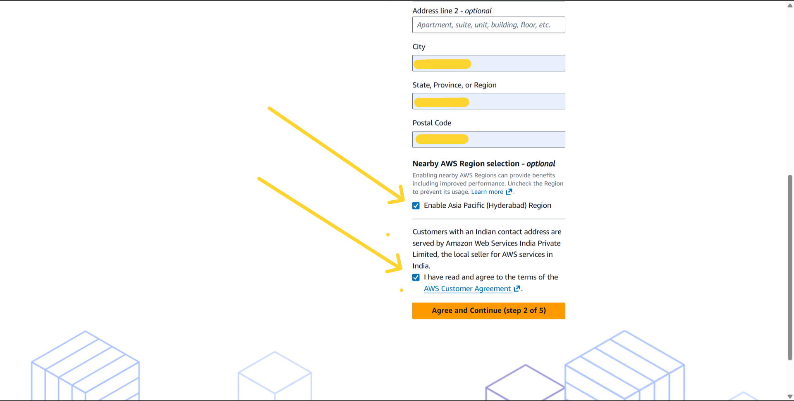

Click **Continue**.✅
---

# Before You Proceed

Ensure that your payment method meets the following requirements:

- International Transactions are enabled (for debit/credit cards, if required by your bank)
- Online (E-commerce) Transactions are enabled
- Sufficient balance is available for temporary verification charges (if applicable)
---

# Step 6: Add Payment Information

## Payment Method Options

During AWS account creation, you can choose one of the following payment methods:

- UPI
- Debit/Credit Card

---

# Option 1: Sign Up Using UPI

1. Select **UPI** as the payment method.
2. Enter your UPI ID (for example: username@upi).
3. Verify the UPI ID if prompted.
4. Open your UPI application (Google Pay, PhonePe, Paytm, BHIM, etc.).
5. Approve the payment request.
6. Wait for the payment verification to complete.
7. Once the payment is successful, AWS continues the account creation process.

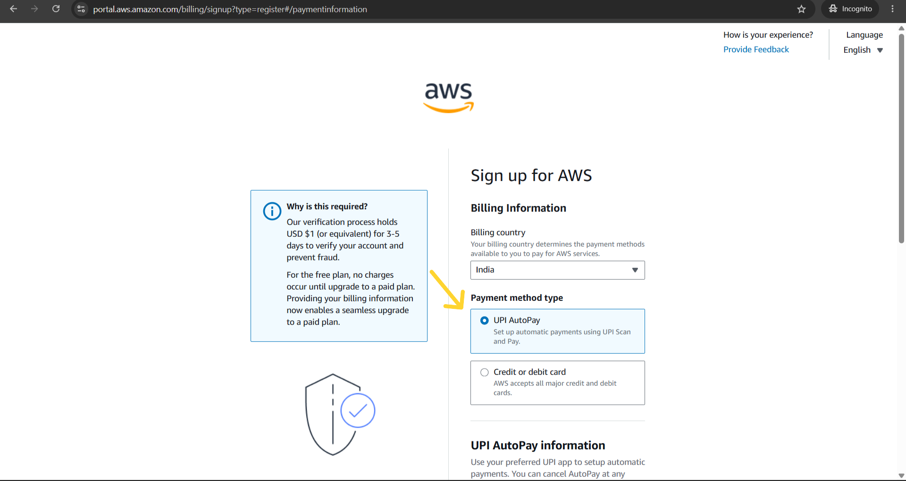

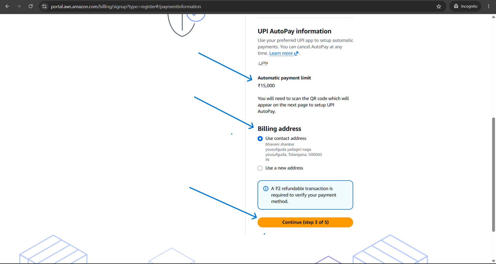

### Verify Your Payment Method

**Step:** Scan the displayed **QR code** using any UPI-enabled application (such as Google Pay, PhonePe, Paytm, BHIM, Amazon Pay, or your bank's UPI app) and complete the **₹2 refundable verification payment**. Ensure that the payment is completed before the QR code expires. Do not refresh, close, or navigate away from the page until the payment verification process has been completed successfully.

*Figure: AWS payment verification page showing the ₹2 refundable UPI verification payment.*

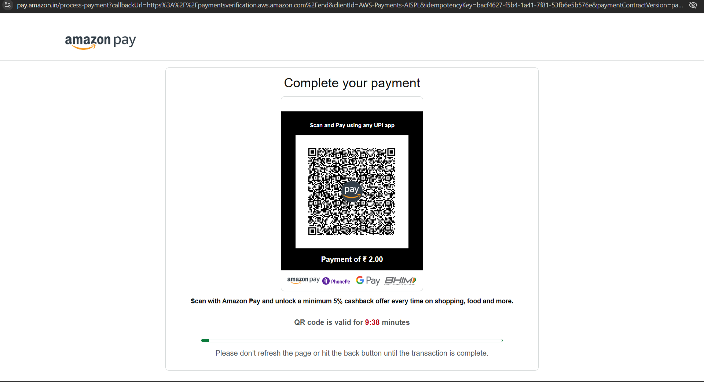

---

>After successfully completing the ₹2 verification payment, AWS prompts you to set up UPI AutoPay for future billing.

- Click Verify to proceed with the UPI AutoPay setup.

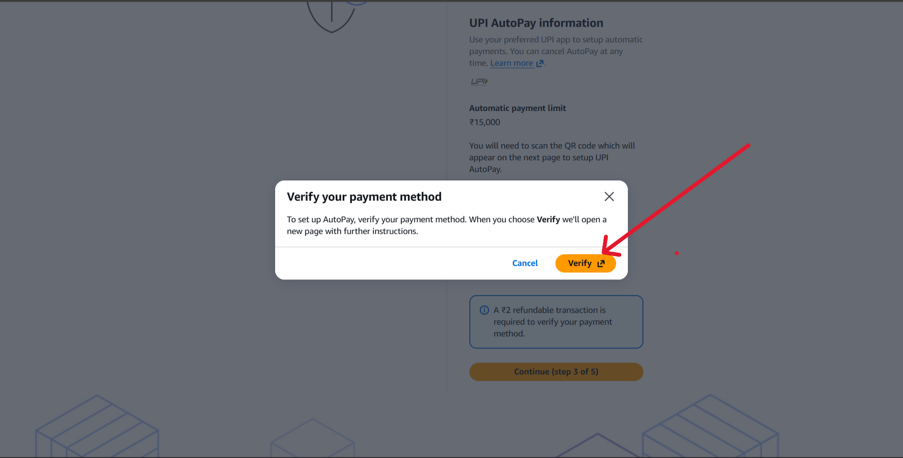

- The displayed ₹15,000 limit is the maximum UPI AutoPay spending limit and does not mean that ₹15,000 will be charged to your account.
- During the AWS account creation process, AWS does not deduct ₹15,000 from your account.
---

# Option 2: Sign Up Using Debit/Credit Card

1. Select **Debit/Credit Card** as the payment method.

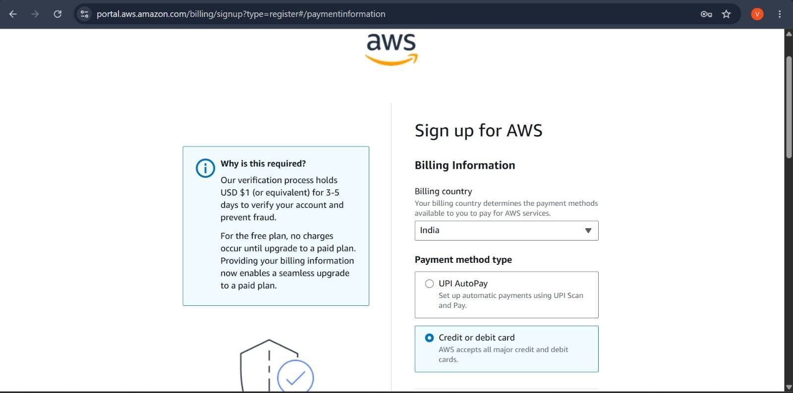

2. Enter the following details:
   
   - Card Number
   - Expiration Date
   - CVV
   - Name on the Card
   - ❌ **ignore** save card and charge automatically for future payments
   - Choose Billing Address
   - **Pan card Yes or No** ( your choice)

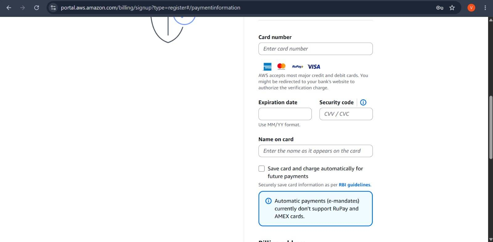

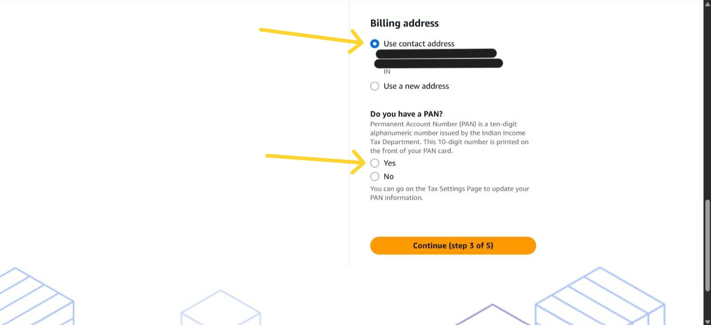

1. Click **Continue**.
2. Complete the **OTP verification**.
3. Wait for the payment verification to complete.
4. Once the payment is successful, AWS continues the account creation process.

> **Note:** Ensure that International and Online (E-commerce) Transactions are enabled on your card.

<!--📷 Screenshot: Card Payment-->

---
# Step 7: Confirm Your Identity for AWS Account Registration

- **Primary Purpose of Account Registration:** Personal use✅
- **Ownership Type:** Individual✅

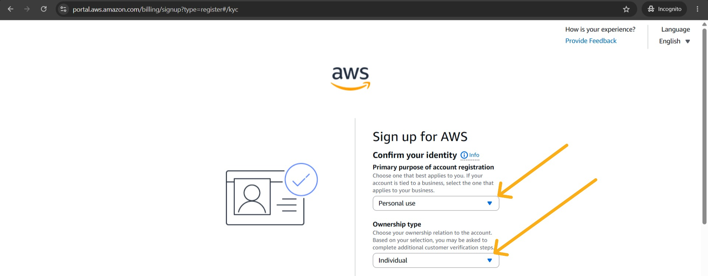

---

# Step 8: Verify Your Identity

Complete the identity verification process:

- Enter your Mobile Number
- Complete the CAPTCHA
- Click **Send SMS**
- Enter the OTP received on your mobile
- Click **Continue**

<!--📷 Screenshot: Step-07-->

---

# Step 9: Wait for Account Activation

AWS will verify your information and activate your account.

Most accounts are activated within a few minutes.

In some cases, activation may take up to **24 hours**.

<!--📷 Screenshot: Step-09-->

---

# Step 10: Sign In to the AWS Management Console

Open:

https://console.aws.amazon.com/

Choose:

- Root User

Enter:

- Email Address
- Password

Click **Sign In**.

<!--📷 Screenshot: Step-10-->

---

# Troubleshooting

If you encounter issues during account creation, check the following:

- Verify that your email address is correct.
- Ensure your mobile number can receive SMS messages.
- Confirm that International and Online (E-commerce) Transactions are enabled on your card.
- Wait for account activation if it is still pending.
- Retry after a few minutes if verification fails.
- Contact AWS Support if the issue persists.

---

# Next Steps

After successfully creating your AWS account, it is recommended to:

- Enable Multi-Factor Authentication (MFA) for the Root User.
- Create an IAM User for daily administrative tasks.
- Configure Billing Alerts to monitor AWS usage and avoid unexpected charges.

---

# References

**AWS Free Tier**

https://aws.amazon.com/free/

**AWS Management Console**

https://console.aws.amazon.com/