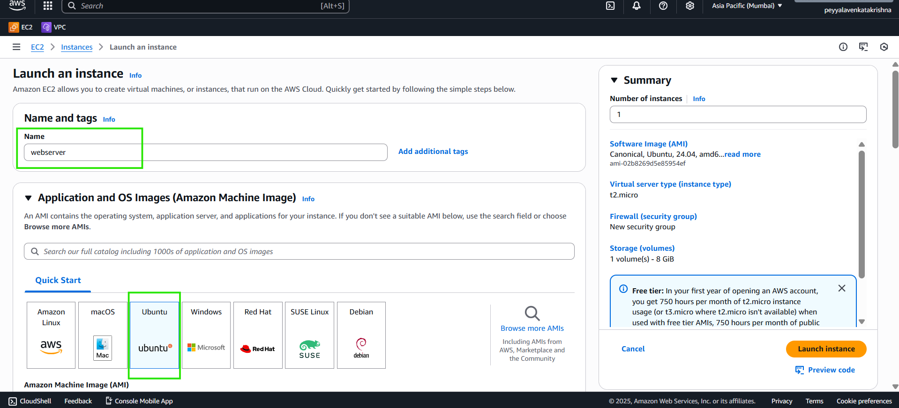
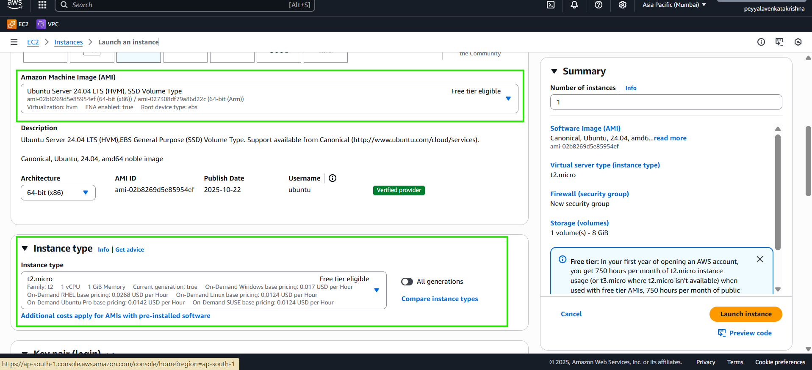
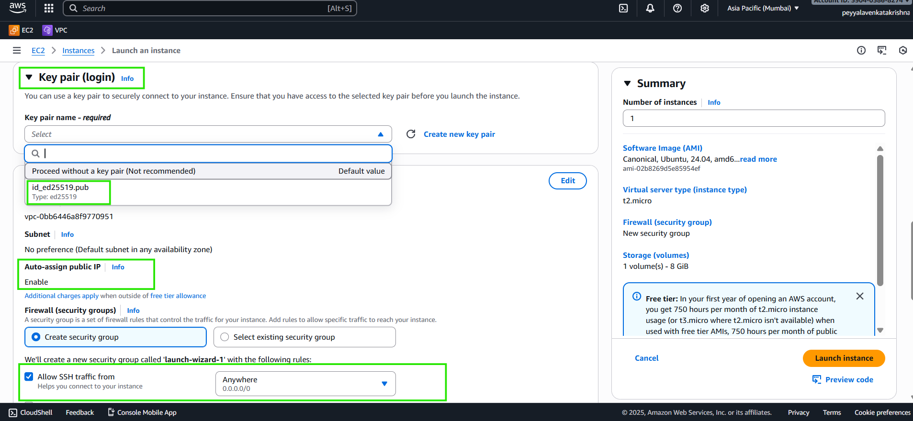
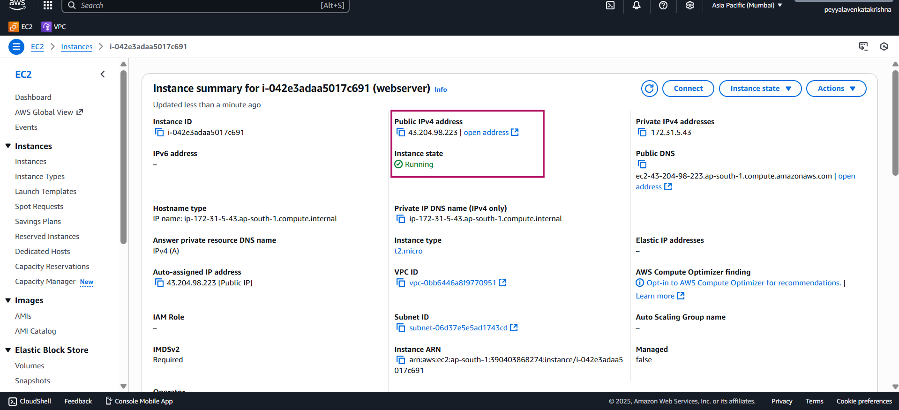

## How to Launch AWS **Ubuntu** Instance with **Imported Key**

1. Open AWS Management Console and go to EC2 Dashboard.

2. Click **Launch Instance**.


3. Select an Ubuntu Server AMI (e.g., Ubuntu 20.04 LTS or Ubuntu 24.04 ).



4. Choose the instance type (e.g., t2.micro for free tier).



5. In the **Key Pair** section, select the imported SSH key pair from the dropdown.



6. Configure security group to allow SSH (port 22) access from your IP address.

7. Review and click **Launch** to start the instance.


8. Wait for the instance to enter the "running" state.

9. Note the public IP address of the instance for SSH access.



10. To connect to Instance, Open Terminal and run the command

**From PowerShell (Windows Default)**
```bash
# Simple - uses default ~/.ssh/id_ed25519 automatically
ssh ubuntu@43.204.98.223

# Explicit key path (run from .ssh folder or use full path)
ssh -i .\.ssh\id_ed25519 ubuntu@43.204.98.223
```
**From Git Bash**
```bash
# Simple - uses default ~/.ssh/id_ed25519 automatically
ssh ubuntu@43.204.98.223

# Explicit key path (run from .ssh folder or use full path)
ssh -i .ssh/id_ed25519 ubuntu@43.204.98.223
```

**Key Benefits**
- **Simple command**: Faster typing, auto-loads default key via ssh-agent [learn.microsoft](https://learn.microsoft.com/en-us/windows-server/administration/openssh/openssh_keymanagement)
- **Explicit `-i`**: Precise control, works without ssh-agent, better for scripts [linuxbabe](https://www.linuxbabe.com/linux-server/ssh-windows)


***