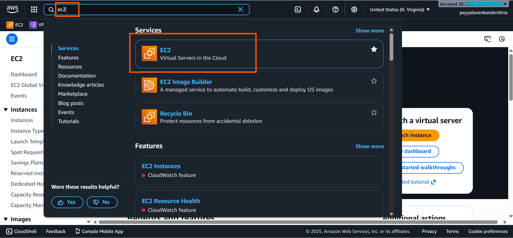

# How to Import an Existing SSH Key to AWS EC2 (Windows)

##  To configure locally generated SSH keys for AWS EC2 on Windows

- Login: [aws.amazon](https://aws.amazon.com/free/) 

- click on `Sign in using root user email`(as shownin in below image) 

# Import SSH Key(Public key) to AWS Account (for EC2 launch)

- Open AWS Management Console,
  - **Go to EC2** 

- In EC2 section, 
  - under `Network and security` 
    - **Click on `Key pairs`** 

- Choose "Import Key Pair".

- Enter a key pair name.(Name = your choice)
- Open your public key file (e.g., `id_ed25519.pub`) as shown in the below image(click on browse to open).
- To save Click on Import Key Pair.

- finally it looks as shown in the below image.

## Summary:

### Importing the Public Key to AWS
1. Log into AWS Management Console.
2. Go to EC2 Dashboard.
3. Under "Network & Security," click on **Key Pairs**.
4. Click **Import Key Pair**.
5. Provide a name for your key pair.
6. Open your public key file (`id_ed25519.pub`) in a text editor.
7. Copy the entire contents of the public key file.
8. Paste the copied key into the **Public key contents** field.
9. Click **Import** to save the key pair.
***

**NOTE:**

- **When launching an EC2 instance, your imported key pair appears in the Key pair dropdown under the Key pair section of the launch wizard. This lets you select it during configuration before final launch.**
***