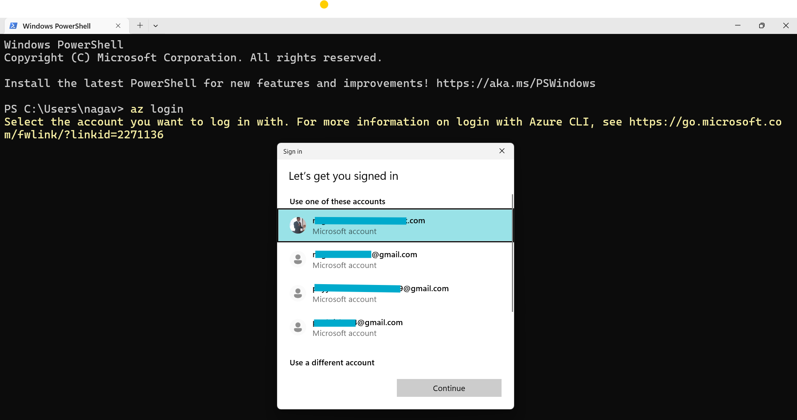
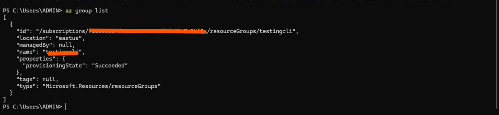

# How to Configure Azure CLI to Your Azure Account

1. **Sign in to Azure:**  
   - Open your terminal or PowerShell.  
   - Run the command:  
     ```
     az login
     ```
   - This opens a browser window for interactive login. If the browser cannot open, follow the instructions to login via a device code, by visiting https://aka.ms/devicelogin and entering the code shown in your terminal.



- Select the email associated with your Azure account and click `Continue`

2. **Select the Subscription (if multiple):**  
   - After login, a list of your Azure subscriptions appears.  
      - Enter the `subscription number`, then press `Enter`.

  
  
  - If your Azure account has multiple subscriptions, enter the number corresponding to your desired subscription. 

   - To set a specific subscription as active, run:  
     ```
     az account set --subscription "<subscription-id>"
     ```
- You can sign in interactively as above, or use service principals or managed identities for scripts and automation. 

3. **Authentication methods:**  
   - Multi-factor authentication (MFA) is now mandatory for user sign-ins in many setups.

## How to Check if Azure CLI Is Configured with Your Azure Account

- Run the command:  
  ```bash
  az account show
  ```
  This displays details of the currently logged-in Azure account and its active subscription.

- To list all resource groups in your subscription:  
  ```bash
  az group list
  ```


- If there are no resource groups, the command outputs an empty list:  
  ```
  []
  ```
- To list all subscriptions associated with your account, run:  
  ```bash
  az account list --output table
  ```

- If these commands return output without errors, it confirms that your Azure CLI is correctly configured and connected to your account.


***