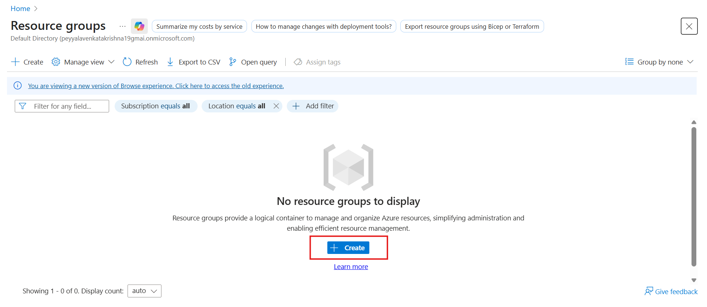
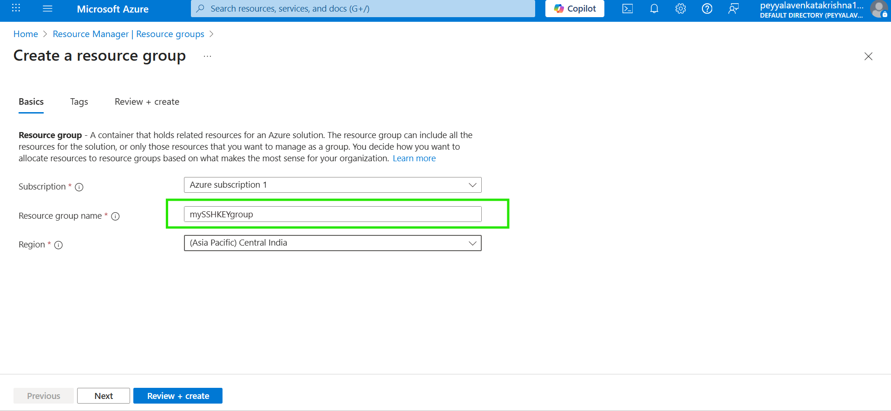
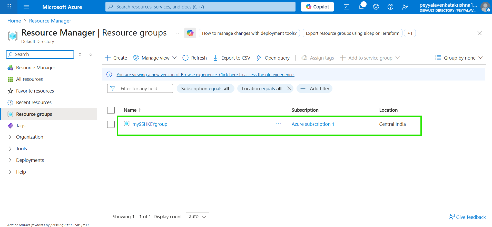

# How to Configure Locally Generated SSH Keys for Azure Linux VMs on Windows

**Generate SSH Key Pair on Windows**  
Open PowerShell or GitBash on Windows (OpenSSH is built-in on Windows 10+). 
   * Run `ssh-keygen` to create a key pair; accept defaults or specify `C:\Users\YourUser\.ssh\id_ed25519` for the path. 
   
   * This generates `id_ed25519` (private) and `id_ed25519.pub` (public) files—keep the private key secure and never share it. [docs.aws.amazon](https://docs.aws.amazon.com/transfer/latest/userguide/windows-ssh.html)

**Create or Update Azure Linux VM with Your Public Key**  
In the Azure Portal, create a new Linux VM (e.g., Ubuntu) and select "SSH public key" under Administrator account. 
   * Paste the contents of your local `id_ed25519.pub` file (starts with `ssh-ed25519`) into the SSH public key field, along with your desired username like `azureuser`. [learn.microsoft](https://learn.microsoft.com/en-us/azure/virtual-machines/linux/ssh-from-windows)

### **NOTE**
**Connect to the VM Securely**  

* From PowerShell, run `ssh azureuser@<VM-Public-IP>` or `ssh -i C:\.ssh\id_ed25519 azureuser@<VM-Public-IP>`. 

* **The first connection adds the host key**; subsequent ones use your private key for passwordless authentication.

* Ensure port 22 is open in the VM's Network Security Group (NSG).

# Steps to Import SSH Public Key via Azure Portal

- To import an existing SSH public key into your Azure cloud account using the Azure Portal follow these steps.

1. **Sign In**
   - Log in to the [https://azure.microsoft.com](https://portal.azure.com) with your account credentials.

## Create Resource Group Using Azure Portal

1. In the left-hand menu, select **Resource groups** (or search "Resource groups" in the top search bar).

2. Click **+ Create** or **+ Add** at the top.

3. On the Create a resource group page:
   - **Subscription:** Select your Azure subscription.
   - **Resource group name:** Enter a unique name for the resource group.
   - **Region:** Select the Azure region where you want the resource group to reside.

4. Click **Review + create**.

5. After validation succeeds, click **Create**.

6. The resource group was created successfully and the details are displayed as follows:

2. **Navigate to SSH Key Management**
   - In the left menu or the search bar, type and select **SSH keys** or head to **Azure Home > SSH keys** (sometimes under "Security + Networking" or can be searched directly).

   

3. **Add SSH Key**
   - Click on **+ Add** or **Create** (may appear as “+ Add SSH key” or “+ Create SSH key”).

4. **Configure SSH Key Details**

   - **Subscription:** Select your Azure subscription.
   - **Resource group** choose the **Resource group name** which you have created.
   - **Region:** Select a region. Azure just stores the key metadata here; you can use the key in all regions.
   - **Key pair name:** Enter a meaningful, unique name for this key (for tracking and selection purposes).
   - **SSH public key source:** Choose “Upload existing public key” (not generate new).

5. **Paste the Public Key**
   - In the upload field, paste the entire contents of your existing SSH public key file (for example, contents of `id_rsa.pub` or `id_ed25519.pub`). (Remove any extra whitespace)

6. **Review + Create**
   - Click **Review + create**. Azure runs validation on the input.

7. **Create and Finish**
   - Once validation passes, click **Create**. The SSH public key is now stored in your Azure account and available for assigning to virtual machines or other resources when needed.

***

### Additional Tips  

- You can copy your public key again later by clicking on the key you uploaded and using the **Copy to clipboard** option.

- The uploaded public key can now be selected as an authentication method when creating or connecting to Linux VMs.

- At creation time for a VM, choose “Use existing key stored in Azure” to assign this imported public key.

***

